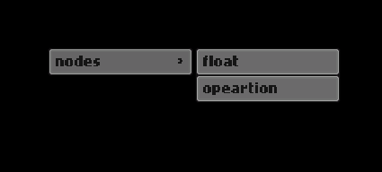
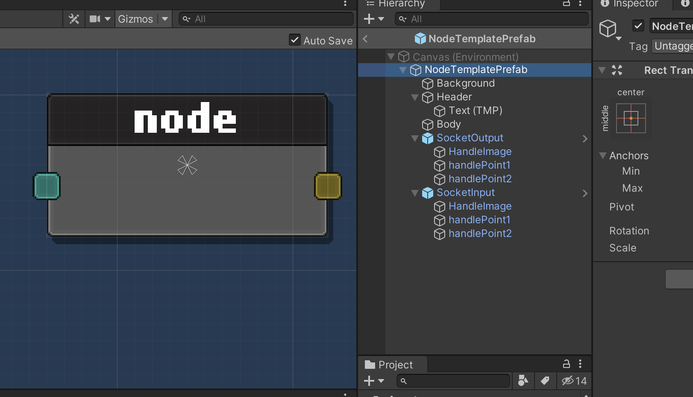
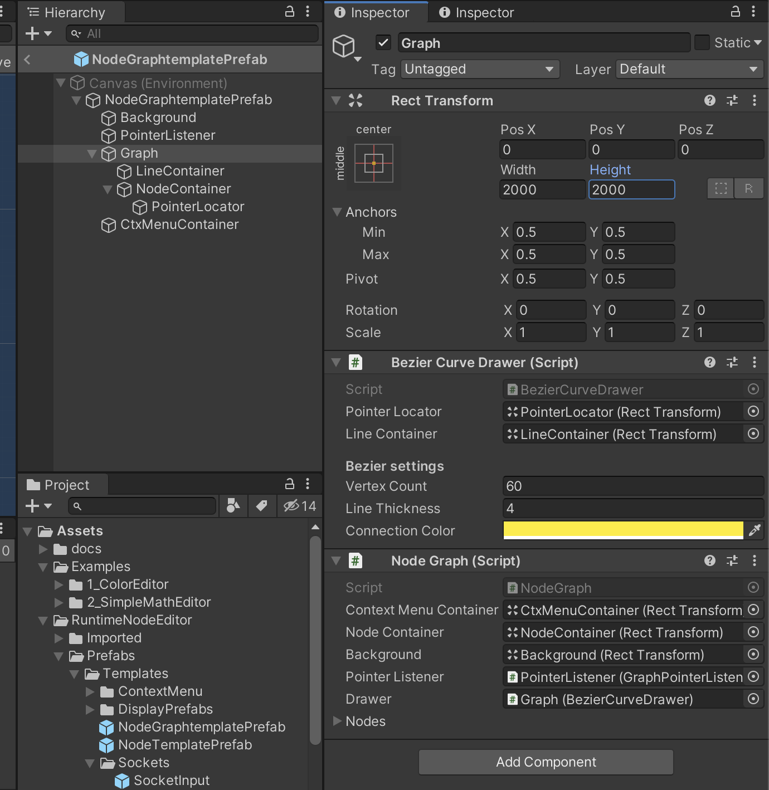
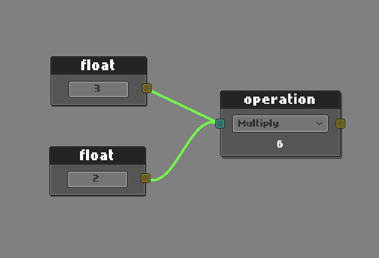

# Quick overview

- RuntimeNodeEditor is a unityUI based node editor and works in playmode.

- A connection happens between a `InputSocket.cs` and `OutputSocket.cs` all derived from `Socket.cs`.

- A `Node.cs` is a container for sockets. It listens connection events for its sockets.

- A `NodeGraph.cs` can create nodes and draws connections between sockets. Can be exported or serialized into json file.

- `NodeEditor.cs` is derives from `MonoBehavior` and lives in the scene. Can listen graph events. It has a simple context menu feature.

- It is possible to have multiple node editors in a scene. Each editor will handle its events and process them.

- Works completely event based. Integrates with unity `EventSystem` to listen pointer events for sockets, nodes and graph.

- Customizable for every detail. Some parts of the framework require manual work 


# Getting started

RuntimeNodeEditor is intended as a framework to work easily in a unity scene. 
It can be setup with a minimal configuration and its event based flow allows users to create their system on top of it. 

## Quick tutorial

Simply extend the `NodeEditor`.

```c#
public class MyNodeEditor : NodeEditor
{
    public override void StartEditor(NodeGraph graph)
    {
        base.StartEditor(graph);

        //  make your custom initialization here
    }
}
```

```c#
public class ApplicationStartup : MonoBehaviour
{
    public RectTransform editorHolder;   //nested in a canvas object
    
    private MyNodeEditor _editor;

    private void Start()
    {
        _editor = gameObject.AddComponent<MyEditor>();        
        var graph = _editor.CreateGraph<NodeGraph>(editorHolder, Color.black, Color.green);
        _editor.StartEditor(graph);
    }
}
```

If we run this example, a graph will be instantiated as a child in `editorHolder` object. But editor and graph won't do anything. Let's add some functuionality.

RuntimeNodeEditor relies on `Resorces` folder to instantiate node prefabs. Project comes with a couple of node prefab examples. We'll use the sample nodes like below.

```c#
public class MyNodeEditor : NodeEditor
{
    public override void StartEditor(NodeGraph graph)
    {
        base.StartEditor(graph);

        //  make your custom initialization here

        //  use fluent builder create a context
        var ctx = new ContextMenuBuilder()

        .Add("nodes/float",     ()=> Graph.Create("Nodes/FloatNode"))
        .Add("nodes/opeartion", ()=> Graph.Create("Nodes/MathOperationNode"))
        .Build();

        //  set the context
        SetContextMenu(ctx);
    }
}
```

Now we should tell how to display the context menu.

```c#
public class MyNodeEditor : NodeEditor
{
    public override void StartEditor(NodeGraph graph)
    {
        base.StartEditor(graph);

        //  make your custom initialization here

        //  use fluent builder create a context
        var ctx = new ContextMenuBuilder()

        .Add("nodes/float",     ()=> Graph.Create("Nodes/FloatNode"))
        .Add("nodes/opeartion", ()=> Graph.Create("Nodes/MathOperationNode"))
        .Build();

        //  set the context
        SetContextMenu(ctx);

        //  listen graph events
        Events.OnGraphPointerClickEvent += OnClick;
    }

    private void OnClick(PointerEventData eventData)
    {
        //  handle event
    }
}
```

We subscribe to `OnGraphPointerClickEvent` to listen pointer events on graph. Let's add what to do.

```c#
public class MyNodeEditor : NodeEditor
{
    ...

    private void OnClick(PointerEventData eventData)
    {
        if(eventData.button == PointerEventData.InputButton.Left)
        {
            CloseContextMenu();
        }
            
        if(eventData.button == PointerEventData.InputButton.Right)
        {
            DisplayContextMenu();
        }
    }
}
```

Let's right click and see the result.



Last part is the context menu prefab, it also comes with samples. You can modify the prefab's visuals to fit for your needs easily.

```c#
public class ApplicationStartup : MonoBehaviour
{
    public RectTransform editorHolder;
    public GameObject ctxMenuPrefab; // 1. assigned from the scene
    
    private MyEditor _editor;

    private void Start()
    {
        _editor = gameObject.AddComponent<MyEditor>();
        _editor.contextMenuPrefab = ctxMenuPrefab;  // 2. assign to editor
        
        var graph = _editor.CreateGraph<NodeGraph>(editorHolder, Color.black, Color.green);
        _editor.StartEditor(graph);
    }
}
```

Note that the context menu is an optional feature. `NodeEditor` won't need it in order to operate (Check out RGB color display example in `Examples` folder).

Now if you hit play, you can zoom in/out with middle mouse scroll, middle button drag to navigate and left button to connect sockets from your nodes.


Here is the complete sample: 

```c#
public class MyEditor : NodeEditor
{
    public override void StartEditor(NodeGraph graph)
    {
        base.StartEditor(graph);

        var ctx = new ContextMenuBuilder()
            .Add("nodes/float", ()=> Graph.Create("Nodes/FloatNode"))
            .Add("nodes/opeartion", ()=> Graph.Create("Nodes/MathOperationNode"))
            .Build();

        SetContextMenu(ctx);

        Events.OnGraphPointerClickEvent += OnClick;
    }

    private void OnClick(PointerEventData eventData)
    {
        if(eventData.button == PointerEventData.InputButton.Left)
        {
            CloseContextMenu();
        }
            
        if(eventData.button == PointerEventData.InputButton.Right)
        {
            DisplayContextMenu();
        }
    }
}
```

```c#
public class ApplicationStartup : MonoBehaviour
{
    public RectTransform editorHolder;
    public GameObject   ctxMenuPrefab;
    
    private MyEditor   _editor;

    private void Start()
    {
        _editor = gameObject.AddComponent<MyEditor>();
        _editor.contextMenuPrefab = ctxMenuPrefab;
        
        var graph = _editor.CreateGraph<NodeGraph>(editorHolder, Color.black, Color.green);
        _editor.StartEditor(graph);
    }
}
```


## Example editors in project

Check out `Examples` folder in the project for more.

- RGB color display
- Simple math editor


## Core concepts

- Socket and Connection
- Node
- NodeGraph
- NodeEditor
- ContextMenu
- Serializing

### Socket and Connection

> `output(value)` --> connection --> `input`

A single connection happens between an input and an output socket. 
This is a one-direction communication from an output to an input. An input may accept single or multiple connections. 

`SocketInput` and `SocketOutput` is implemented to work as generic sockets derived from abstract `Socket`. 

`SocketOutput` implements `IOutput` interface for easily share and read the incoming value as an object.

```c#
public interface IOutput
{
    T GetValue<T>();
    event Action ValueUpdated;
}
```

### Node

```c#
public class SampleNode : Node
{
    public SocketOutput myOutput;
}
```

`Node` is a hub for sockets. It registers and controls its sockets when a connection invoked. 


When a connection established, input socket's owner node invokes the `OnConnectionEvent` event.


```c#
public class SampleNode : Node
{
    ...
    
    //  fields
    //  ui objects fields
    //  input or output sockets 

    ...

    public override void Setup()
    {
        //  setup your custom node here

        OnConnectionEvent += OnConnection;
        OnDisconnectEvent += OnDisconnect;
    }

    public void OnConnection(SocketInput input, IOutput output)
    {
        output.ValueUpdated += OnConnectedValueUpdated;
    }

    public void OnDisconnect(SocketInput input, IOutput output)
    {
        output.ValueUpdated -= OnConnectedValueUpdated;
    }
}
```

This way it is possible to listen connection and disconnection events to get information from outputs.

### NodeGraph

`NodeGraph` contains nodes, connections. Graph can create a node by providing its prefab path from `Resources` folder.

```c#
public class MyNodeEditor : NodeEditor
{
    ...

    private void SomeMethod()
    {
        Graph.Create("path/to/prefab/in/Resources");
    }
}

```

Following a prefab path is a design decision. It has a certain benefits to make prefab instantiation easy (and serialization)but comes with some manual work for sure. 

Graph connects sockets by listening pointer events by default. It is possible to override its virtual methods or make costumizations.

It also listens the pointer events from graph, nodes and connections. Check out `SignalSystem.cs` for the complete events.


### NodeEditor

`NodeEditor` is the entry point of the framework. A standart editor can be simplified like below.

```c#
public class MyNodeEditor : NodeEditor
{
    public override void StartEditor(NodeGraph graph)
    {
        base.StartEditor(graph);


        //  Create, delete or duplicate nodes
        
        //  Show or hide context menu
        
        //  Set context menu actions

        //  Serialize graph

        //  Listen events
    }
}

```

### Context menu

RuntimeNodeEditor comes with a simple context menu solution.
Context menu is totally optional but I believe that a node editor wouldn't be enjoyful without a context menu.

An example for context menu actions:
 
```c#
public class MyNodeEditor : NodeEditor
{
    public override void StartEditor(NodeGraph graph)
    {
        base.StartEditor(graph);

        var ctx = new ContextMenuBuilder()
        .Add("greeter", () => Debug.Log("hello world!"))
        .Build();

        SetContextMenu(ctx);

        Events.OnGraphPointerClickEvent += OnGraphPointerClick;
    }

    private void OnGraphPointerClick(PointerEventData eventData)
    {
        DisplayContextMenu();
    }
}
```

This way, we can handle cases like without an action selection.

```c#
public class MyNodeEditor : NodeEditor
{
    ...
    
    private void OnGraphPointerClick(PointerEventData eventData)
    {
        switch (eventData.button)
        {
            case PointerEventData.InputButton.Right: DisplayContextMenu(); break;
            case PointerEventData.InputButton.Left:  CloseContextMenu();   break;
        }
    }

}
```

### Serializing

A graph can be serialized and deserialized. Graph will iterate nodes and connections. 

But this flow requires manul work for nodes like below. 

```c#

//  FloatNode.cs
public class FloatNode : Node
{
    public TMP_InputField valueField;
    
    ...

    public override void OnSerialize(Serializer serializer)
    {
        serializer.Add("floatValue", valueField.text);
    }

    public override void OnDeserialize(Serializer serializer)
    {
        var value = serializer.Get("floatValue");
        valueField.SetTextWithoutNotify(value);

        ...
    }

    ...
}

```
 
> `Duplicate` method in NodeGraph uses relies on serialization too. Target node must implement serialization.

Serializitaion produces a json string and NodeGraph can write it as a file to specified path. It uses unity `JsonUtility`.

`JsonUtility` can be used for advanced cases like below

```c#

//  Serialize
var jsonData = JsonUtility.ToJson(myCustomData);
serializer.Add("myData", jsonData);


//  Deserialize
var jsonData = serializer.Get("myData");   
myCustomData = JsonUtility.FromJson<CustomJsonData>(jsonData);    
```

Finally save to a file or load from a file.

```c#

//  ExampleNodeEditor.cs
public class MyNodeEditor : NodeEditor
{
    ...

    private void SaveGraph(string savePath)
    {
        Graph.Save(savePath);
    }

    private void LoadGraph(string savePath)
    {
        Graph.Clear();
        Graph.Load(savePath);
    }

    ...
}

```

## How to create a node

Simply call `Create(string path)` method from `NodeGraph`.

```c#
public class MyNodeEditor : NodeEditor
{
    ...
    private void CreateANode()
    {
        Graph.Create("path/to/prefab/from/Resources");
    }
}
```

## Make your custom node

1. **Create a class**

```c#
public class MyCustomNode : Node
{
    //  define ui objects


    //  define connection sockets
    public SocketInput inputSocket;
    public SocketOutput outputSocket;


    public override void Setup()
    {
        //  make your initializations
        Register(inputSocket);
        Register(outputSocket);

        //  give a name
        SetHeader("float");

        //  listen connection events
        OnConnectionEvent += OnConnection;
        OnDisconnectEvent += OnDisconnect;  
    }

    public void OnConnection(SocketInput input, IOutput output)
    {
        //  register to listen output changes
        output.ValueUpdated += OnConnectedValueUpdated;

        //  you might need to cache the output
        //  to check which output value changed
    }

    public void OnDisconnect(SocketInput input, IOutput output)
    {
        output.ValueUpdated -= OnConnectedValueUpdated;
    }

    private void OnConnectedValueUpdated()
    {
        //  handle output change
        //  update ui
    }

    public override void OnSerialize(Serializer serializer)
    {
    }

    public override void OnDeserialize(Serializer serializer)
    {
    }
}
```

> `OnSerialize` and `OnDeserialize` methods are needed for serialization. Also node duplication from graph relies on this methods. Otherwise graph serialization won't work.


2. **Create a prefab**

Default node template prefab can be found at `RuntimeNodeEditor/Prefabs/Templates/NodeTemplatePrefab`. 



3. **Place it in Resources folder**

Now, your node is ready, you can create your node from the graph.

4. **Create from `NodeGraph`**

```c#
Graph.Create("MyNodeFolderInResources/MyNodePrefabName");
```

## Make your custom graph

NodeGraph lives in the scene as an object with carefully nested multiple children objects. Its structure is important and a bit complicated at first glance. 

To make it a litle bit easier to provide a graph, a programmatic option is available in `NodeEditor` and view can be created in scene via api like below.

```c#
public class ApplicationStartup : MonoBehaviour
{
    public RectTransform editorHolder;   //nested in a canvas object
    
    private MyNodeEditor _editor;

    private void Start()
    {
        _editor = gameObject.AddComponent<MyEditor>();        
        var graph = _editor.CreateGraph<NodeGraph>(editorHolder, Color.black, Color.green);
        _editor.StartEditor(graph);
    }
}
```

But for further customization following steps may be needed.

### Overriding `NodeGraph`

NodeGraph is the core part of the system. It responsible for nodes, connections and listening pointer events. 

If your graph requires custom behaviors, graph can be overridden.

```c#
public class CustomGraph : NodeGraph
{
    protected override void OnOutputDragStarted(SocketOutput socketOnDrag)
    {
        //  custom handle output drag
    }
}
```

Check out `NodeGraph.cs` more virtual handler methods.

### Graph Events

Here is an example for modifiying a connection color when a connection created.

```c#
//  ExampleNodeEditor.cs
public class MyNodeEditor : NodeEditor
{

    public override void StartEditor(NodeGraph graph)
    {
        base.StartEditor(graph);

        Events.OnSocketConnect  += OnConnect;
    }

    private void OnConnect(SocketInput arg1, SocketOutput arg2)
    {
        //  change the color
        Graph.drawer.SetConnectionColor(arg2.connection.connId, Color.green);
    }
}
```

Check out `SignalSystem.cs` for more events.

### Graph Prefab

You may want to change graph visuals and nest more visual objects by modifiying the template prefab at `RuntimeNodeEditor/Prefabs/Templates/NodeTemplatePrefab`. 



## How to serialize a graph

RuntimeNodeEditor provides a simple serialization.

As an example let's save the graph below.



```c#

//  extract the serialized graph data as json 
var graphData = Graph.ExportJson();

//  or

//  save as json file to path
Grap.Save("path/to/file");

```

Let's take a look at serialized json.

```json
{
    "nodes": [
        {
            "id": "06ecc99d-9af3-421f-a95d-95cb65d31b8d",
            "values": [
                {
                    "key": "floatValue",
                    "value": "2"
                }
            ],
            "posX": -169.0,
            "posY": 99.0,
            "path": "Nodes/FloatNode",
            "inputSocketIds": [],
            "outputSocketIds": [
                "183962ca-12d4-4990-b90d-ffd58fa14a74"
            ]
        },
        {
            "id": "3fa5c9d0-2897-4f93-aa73-7d38e2a9b728",
            "values": [
                {
                    "key": "floatValue",
                    "value": "3"
                }
            ],
            "posX": -156.0,
            "posY": -21.0,
            "path": "Nodes/FloatNode",
            "inputSocketIds": [],
            "outputSocketIds": [
                "820e3932-e6bd-4735-b9cc-f861e9fb10d9"
            ]
        },
        {
            "id": "cb0a2086-00d0-43a9-bf83-8774706f8fe5",
            "values": [
                {
                    "key": "outputValue",
                    "value": "6"
                },
                {
                    "key": "opType",
                    "value": "0"
                }
            ],
            "posX": 140.0,
            "posY": 28.0,
            "path": "Nodes/MathOperationNode",
            "inputSocketIds": [
                "3088e0d3-f1b4-459d-b087-5138fae77a7c"
            ],
            "outputSocketIds": [
                "ba5bebe1-1a1b-4e57-bd81-86c491abe168"
            ]
        }
    ],
    "connections": [
        {
            "id": "24e8943f-4bdb-4a6a-b71a-7d86add05cd8",
            "outputSocketId": "183962ca-12d4-4990-b90d-ffd58fa14a74",
            "inputSocketId": "3088e0d3-f1b4-459d-b087-5138fae77a7c"
        },
        {
            "id": "22814050-65c5-4a96-92c3-09e4d55dbb36",
            "outputSocketId": "820e3932-e6bd-4735-b9cc-f861e9fb10d9",
            "inputSocketId": "3088e0d3-f1b4-459d-b087-5138fae77a7c"
        }
    ]
}
```

## Make your custom context menu 

Context menu can be easily modified by its prefab.

Default context menu prefab template can be found at `RuntimeNodeEditor/Prefabs/Templates/ContextMenu`.  


