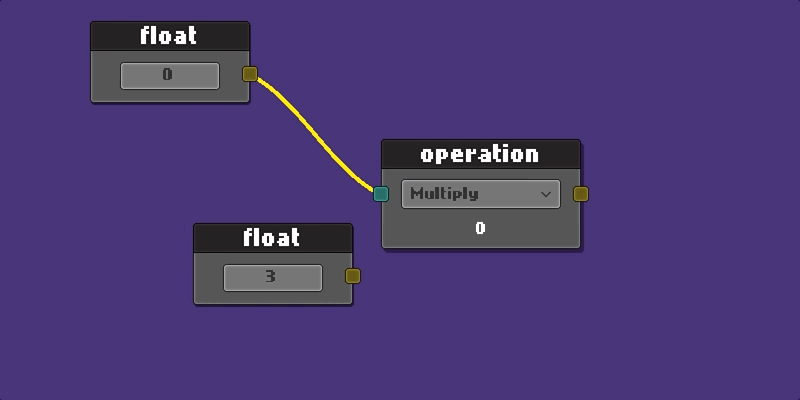
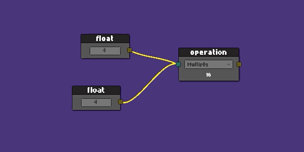
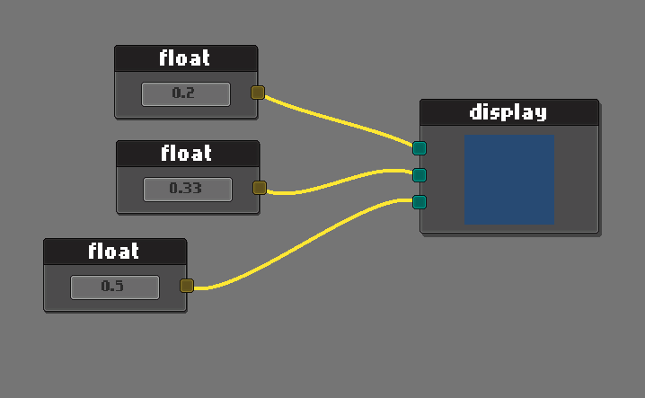
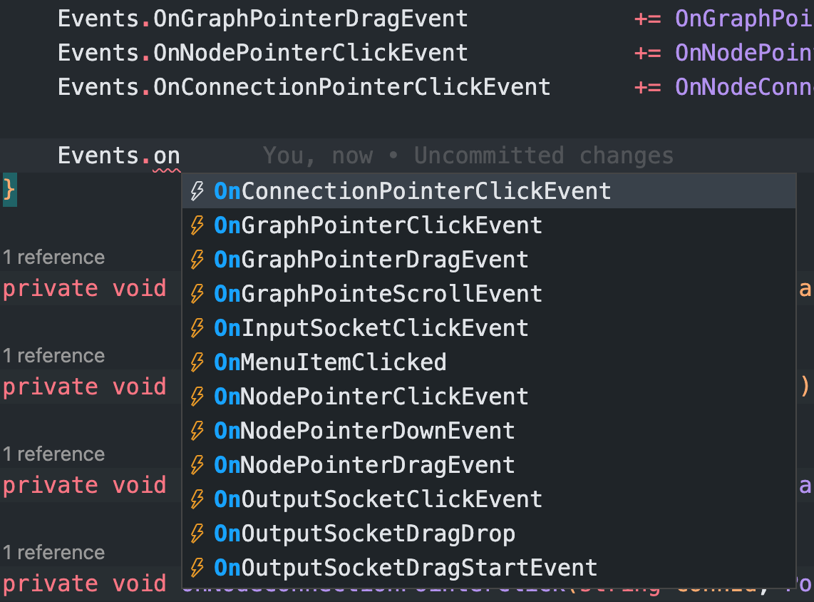

## Runtime Node Editor
Almost every node editor made in unity is using unity editor to make it.  
My goal was make it in runtime with unity ui.

- Socket based connection
- Load and save a graph using node serializer
- Context Menu for graph, nodes and connections
- Event based notification
- Pan and zoom
- Multiple editors can be spawned in a scene
- Create graph by api or custom prefab
- Legacy and new Input System 

Unity version 2021.3.3f1



RGB color display example



## Example
Simply extend the `NodeEditor`.

```c#
public class ExampleNodeEditor : NodeEditor
{
    public override void StartEditor(NodeGraph graph)
    {
        base.StartEditor(graph);

        //  make your custom initialization here
    }
}
```

Create graph using the api, graph will stretch to holder object. (no prefab involves)

```c#
public class ApplicationStartup : MonoBehaviour
{
    public RectTransform        editorHolder;
    public ExampleNodeEditor    editor;    //  asigned in unity from hierarchy

    private void Start()
    {
        var graph = editor.CreateGraph<NodeGraph>(editorHolder);
        // var graph = editor.CreateGraph<NodeGraph>(editorHolder, bgColor, connColor);
        editor.StartEditor(graph);
    }
}

```
You may want to use your own custom graph and prefab as well.

```c#
public class ApplicationStartup : MonoBehaviour
{
    public RectTransform        editorHolder;
    public ExampleNodeEditor    editor;

    private void Start()
    {
        editor.StartEditor(graph);
    }
}
```  
Graph actions are event based.  




You'll find a complete example in the Example folder. Let's walkthrough over.

Listen events from editor
```c#
public class ExampleNodeEditor : NodeEditor
{
    private string _savePath;

    public override void StartEditor(NodeGraph graph)
    {
        base.StartEditor(graph);

        _savePath = Application.dataPath + "/Example/Resources/graph.json";
        
        Events.OnGraphPointerClickEvent           += OnGraphPointerClick;
        Events.OnGraphPointerDragEvent            += OnGraphPointerDrag;
        Events.OnNodePointerClickEvent            += OnNodePointerClick;
        Events.OnConnectionPointerClickEvent      += OnNodeConnectionPointerClick;
    }
}
```
- graph context menu
```c#
protected override void OnGraphPointerClick(PointerEventData eventData)
{
    switch (eventData.button)
    {
        case PointerEventData.InputButton.Right: 
        {
            var ctx = new ContextMenuBuilder()
            .Add("nodes/float",          CreateFloatNode)
            .Add("nodes/math op",       CreateMatOpNode)
            .Add("graph/load",          ()=>LoadGraph(_savePath))
            .Add("graph/save",          ()=>SaveGraph(_savePath))
            .Build();

            SetContextMenu(ctx);
            DisplayContextMenu(); 
        }
        break;
        case PointerEventData.InputButton.Left: CloseContextMenu(); break;
    }
}
```
- node context menu
```c#
protected override void OnNodePointerClick(Node node, PointerEventData eventData)
{
    if (eventData.button == PointerEventData.InputButton.Right)
    {
            var ctx = new ContextMenuBuilder()
            .Add("duplicate",            () => DuplicateNode(node))
            .Add("clear connections",    () => ClearConnections(node))
            .Add("delete",               () => DeleteNode(node))
            .Build();

        SetContextMenu(ctx);
        DisplayContextMenu();
    }
}
```
- connection context menu
```c#
protected override void OnNodeConnectionPointerClick(string connId, PointerEventData eventData)
{
    if (eventData.button == PointerEventData.InputButton.Right)
    {
        var ctx = new ContextMenuBuilder()
        .Add("clear connection", () => DisconnectConnection(connId))
        .Build();

        SetContextMenu(ctx);
        DisplayContextMenu();
    }
}
```


That's been said, to create a new node:
```c#
public class MyAwesomeNode : Node
{
    public TMP_InputField valueField;   //  added from editor
    public SocketOutput outputSocket;   //  added from editor
    public SocketInput inputSocket;     //  added from editor

    public override void Setup()
    {
        Register(outputSocket);
        Register(inputSocket);

        SetHeader("float");
    }

    public override void OnSerialize(Serializer serializer)
    {
        //  save values on graph save
        serializer.Add("floatValue", valueField.text);

        //  it would be good idea to use JsonUtility for complex data
    }

    public override void OnDeserialize(Serializer serializer)
    {
        //  load values on graph load
        var value = serializer.Get("floatValue");
        valueField.SetTextWithoutNotify(value);
    }
}
```
To create a node from your editor, pass its path from `Resources` folder.
```c#
//  context item actions
private void CreateMyNode()
{
    graph.Create("Prefabs/Nodes/MyAwesomeNode");    //  your prefab path in resources
}
```

Check out the complete expample in `ExampleScene` for more details.


This project is actively in development. 
Feel free to drop an issue for any suggestion or feedback.  

Wanna support me? Please, consider checkin out my new project [knightborn](https://store.steampowered.com/app/2748030/Knightborn/).  


### LICENSE  
MIT  
Copyright (c) 2022 Cem Ugur Karacam
